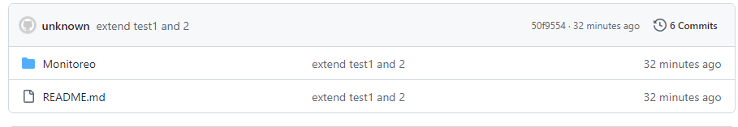
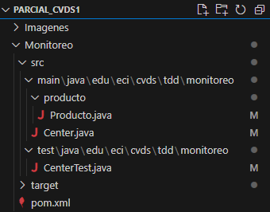
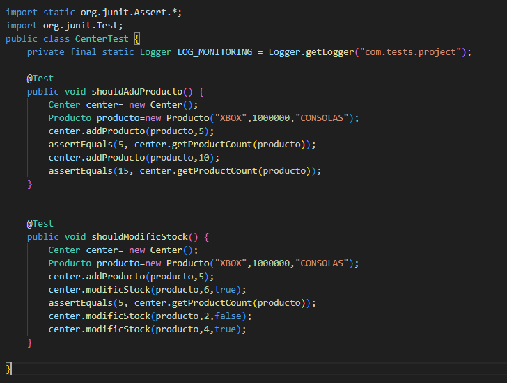
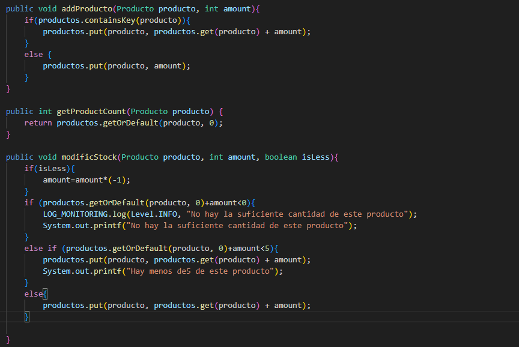
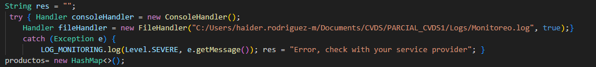

**Iniciamos con la creacion maven del proyecto**

**Planificamos la estructura que deseamos realizar y creamos las clases necesarias para hacerlo**

**Al implementar la estructura deseada, pensamos en los test necesarios para completar los objetivos propuestos**

**El primer test nos debe indicar que al intentar agrega un producto esa accion se realice de manera correcta, ya sea "creando" el producto, o sumandolo a uno ya existente**

**El segundo test, debe verificar que al intentar modificar el stock de un producto este no lo haga si se desea sacar mas de la cantidad existente, y que reporte en caso de que ahora queden menos de 5 (es necesario indicar si se desea returar o sumar el stock del producto)**

**Posteriormente se crea el codigo necesario para hacer que las pruebas funcionen**

**Creamos el codigo necesario para crear el acrchivo log y con esto poder mostrar la informacion en un txt**

**Es necesario cambiar la ruta y el usuario para el computador donde se quiera compilar**

